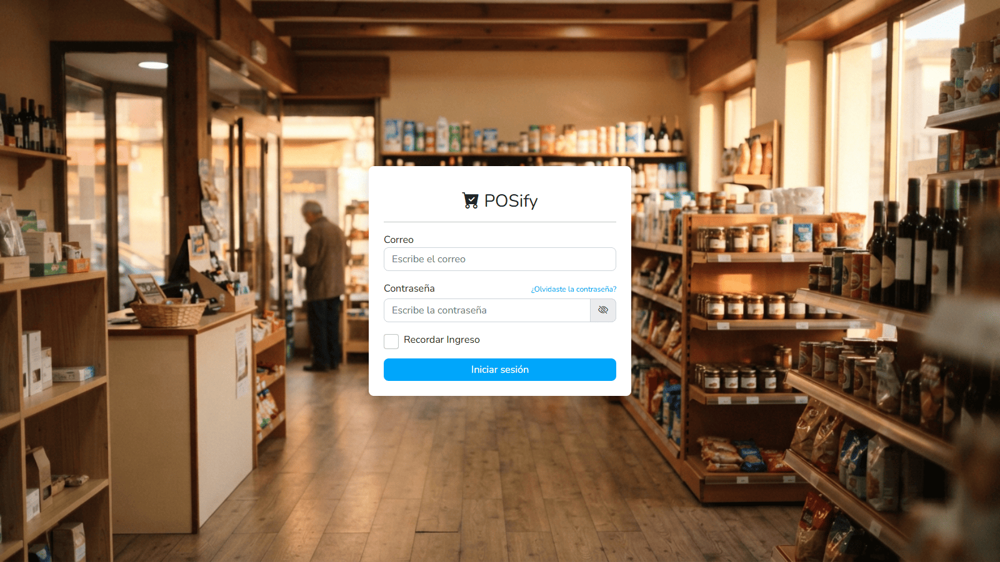

# POSify

> Multi-branch point of sale for a minimarket: stock per branch, a cash drawer
> that closes with a blind count, thermal receipts, and an admin panel
> generated by its own CMS engine.




The point of sale is generated, not written. Three tables (`pages`, `modules`
and `columns`) describe the application, and the engine builds it from that
description. Adding a module does not mean writing a view.

There is no framework underneath either: the code that renders the pages, the
forms and the tables is plain PHP.

## What it does

### Selling

Catalogue with search by name or barcode, a running order, and payment in cash,
card, bank transfer or a mix of two. The receipt is 80 mm, ready for a thermal
printer. Checkout runs inside a transaction with the rows locked, so two
registers cannot sell the same last unit.

### Branches

Stock is per branch: the same product holds different quantities in each one. A
salesperson only sees and bills in their own branch. A manager sees all three,
and can also look at them consolidated.

### The cash drawer

It opens with a float, records movements through the day, and closes with a
count by denomination that compares what was counted against what the system
expects. A mixed payment splits correctly: the cash half lands in the drawer,
the card half does not.

### Taxes

VAT is set per product, not globally. In the sample catalogue rice, milk, eggs
and bread sit at 0%, because Colombian law exempts the basic basket. Everything
else is at 19%.

### Management

Products, categories, purchases, customers, expenses, branches and users, each
with its own listing and form. The engine generates all of them. None were
written by hand.

### Reports

Sales by day and by month, a comparison across branches, best selling products
and most active customers, filtered by branch. All computed in SQL.

## Built with

| | |
|---|---|
| Language | PHP 8.2 |
| Database | MySQL 8, MariaDB 10.4, InnoDB |
| Front end | JavaScript and jQuery |
| Styles | Bootstrap 5 |
| Shape | A REST API plus a panel that consumes it |

The project is two applications living on two domains:

- `api/` serves the data over HTTP, authenticated with JWT
- `cms/` is the panel that consumes it

They were split on purpose, so the API can serve a mobile app or a second
client later without touching the panel.

## Requirements

- PHP 8.2 or newer
- MySQL 8 or MariaDB 10.4 or newer
- Apache with `mod_rewrite`
- XAMPP covers all of the above

## Installing

### 1. Clone it

```bash
git clone https://github.com/S4nti4goCoder/posify.git
cd posify
```

It has to live inside the folder Apache serves:

| System | Folder |
|---|---|
| Windows, XAMPP | `C:\xampp\htdocs\posify` |
| Linux, XAMPP | `/opt/lampp/htdocs/posify` |
| macOS, XAMPP | `/Applications/XAMPP/htdocs/posify` |

### 2. Create the database

Import `database/posify_db.sql` from phpMyAdmin. The file creates the database
and fills it, so there is nothing to create beforehand.

Then create the user the system connects with. In the SQL tab:

```sql
CREATE USER 'posify_system'@'localhost' IDENTIFIED BY 'pick-your-own';
GRANT ALL PRIVILEGES ON posify_db.* TO 'posify_system'@'localhost';
FLUSH PRIVILEGES;
```

Do not use `root`. That account can drop any database on the server; this one
only reaches its own.

### 3. Point the app at it

Copy the example file and fill in your own values:

```
config/config.local.example.php   →   config/config.local.php
```

`config.local.php` is in `.gitignore` and must never be committed.

```php
return [
    'db_host'     => 'localhost',
    'db_name'     => 'posify_db',
    'db_user'     => '',            // the user you created in step 2
    'db_password' => '',

    'api_key'    => '',             // a long random string
    'jwt_secret' => '',             // a different long random string

    'api_base_url' => 'http://api.posify.com/',
    'cms_origin'   => 'http://cms.posify.com',

    'debug' => false,
];
```

Any of those can be overridden by an environment variable using the `POS_`
prefix: `POS_DB_PASSWORD`, `POS_JWT_SECRET`, and so on. Variables win over the
file, so a server never needs the credentials written down.

### 4. Set up the two local domains

This is the step that trips people up. The API and the panel are two
applications with different document roots, so each one needs its own domain.
Opening `localhost/posify` will not work.

First, add the domains to the `hosts` file:

```
127.0.0.1       api.posify.com
127.0.0.1       cms.posify.com
```

| System | File | How |
|---|---|---|
| Windows | `C:\Windows\System32\drivers\etc\hosts` | open the editor as administrator |
| Linux, macOS | `/etc/hosts` | `sudo nano /etc/hosts` |

Second, declare the two virtual hosts:

```apache
<VirtualHost *:80>
    DocumentRoot "C:/xampp/htdocs/posify/api"
    ServerName api.posify.com
</VirtualHost>

<VirtualHost *:80>
    DocumentRoot "C:/xampp/htdocs/posify/cms"
    ServerName cms.posify.com
</VirtualHost>
```

| System | File |
|---|---|
| Windows | `C:\xampp\apache\conf\extra\httpd-vhosts.conf` |
| Linux | `/opt/lampp/etc/extra/httpd-vhosts.conf` |

Adjust the `DocumentRoot` paths to where you cloned. Note that they point at
the `api` and `cms` subfolders, not at the root of the project.

Third, restart Apache.

If you would rather use different domain names, change them in all three
places: `hosts`, the virtual hosts, and the `api_base_url` and `cms_origin`
keys in the config file.

### 5. Sign in

Open `http://cms.posify.com` and use any of the accounts below.

## Demo accounts

The sample database ships with a working shop, Surtihogar, a minimarket with
three branches and 30 products, but no sales. You make those yourself.

| Email | Password | Role | Reaches |
|---|---|---|---|
| `admin@surtihogar.com` | `Surtihogar#2026` | superadmin | Everything, including the page and module builder |
| `gerente@surtihogar.com` | `Gerente#2026` | admin | The three branches |
| `centro@surtihogar.com` | `Vendedor#2026` | vendedor | Surtihogar Centro only |
| `norte@surtihogar.com` | `Vendedor#2026` | vendedor | Surtihogar Norte only |
| `sur@surtihogar.com` | `Vendedor#2026` | vendedor | Surtihogar Sur only |

Sign in as a salesperson and then as the manager to see the difference. The
salesperson finds only their own branch and the pages they were granted.

These are demo credentials, published on purpose. Change them before putting
real data behind them.

### A tour that covers most of it

1. Sign in as `gerente@surtihogar.com`
2. Go to **Caja** and open the drawer with any float
3. Go to **POSify**, create an order and add products
4. Charge it. Try the mixed payment and the extra discount
5. Print the receipt
6. Back to **Caja**, close it by counting the money

That path touches per-branch stock, per-product tax, every payment method, the
thermal receipt and the count at close.

## Layout

```
api/          REST API: routes, controllers and models
cms/          Admin panel and point of sale
  ajax/       Entry points for the asynchronous requests
  controllers/
  views/      Views, including the dynamic page engine
config/       Configuration and secrets, outside both web roots
database/     Database dump
lib/          Own classes: inventory, cash drawer, receipts, security
```

`config/` and `lib/` sit outside the two Apache document roots on purpose. They
cannot be requested over HTTP.

## Security

What is implemented:

- Passwords hashed with bcrypt, rehashed automatically when the cost changes
- A password policy: length, upper case, lower case, digit, symbol, and a check
  against a list of common passwords
- CSRF protection on the forms and on the asynchronous requests
- Sessions with `use_strict_mode`, `HttpOnly` and `SameSite` cookies, and the
  id regenerated on sign in
- Login throttling per email and per IP
- Per-page permissions, enforced on the server and not only in the menu
- Password recovery with a single use code, stored hashed and with an expiry
- Output escaped in the views
- Uploads restricted to a whitelist of extensions, with PHP execution blocked
  in the upload folder
- Checkout wrapped in a transaction with the rows locked

## Notes

The catalogue images are generated and the brands are invented. They do not
correspond to any real product or brand.

---

## Author

Built by **Santiago Quintero**, full stack developer.

[](https://santiagocoder.vercel.app)
[](https://github.com/S4nti4goCoder)
